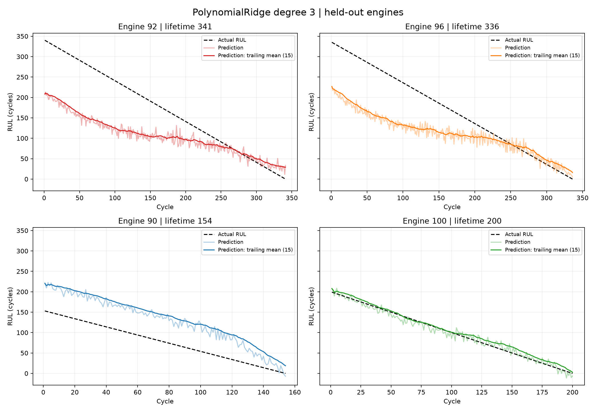
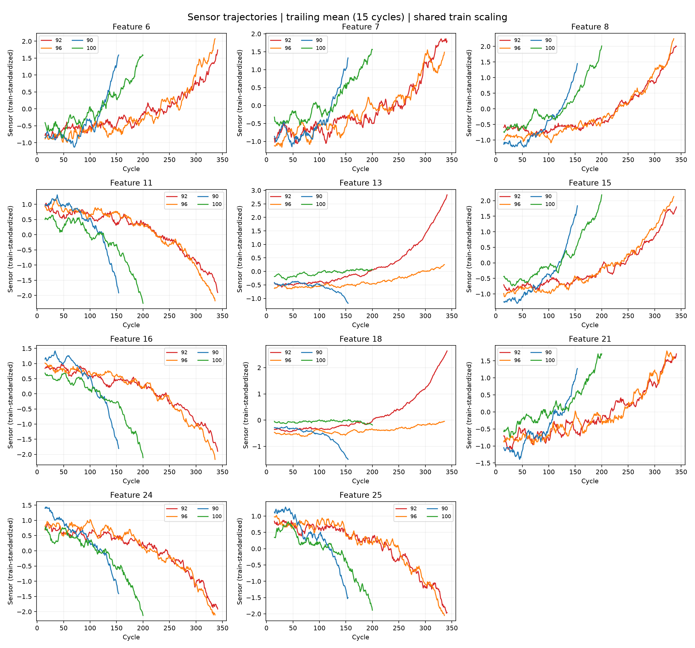
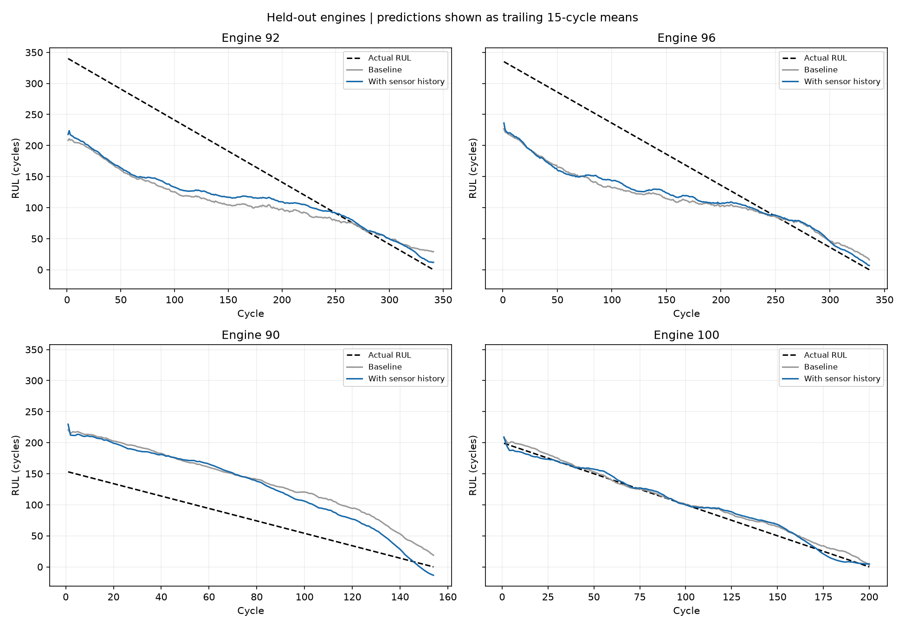
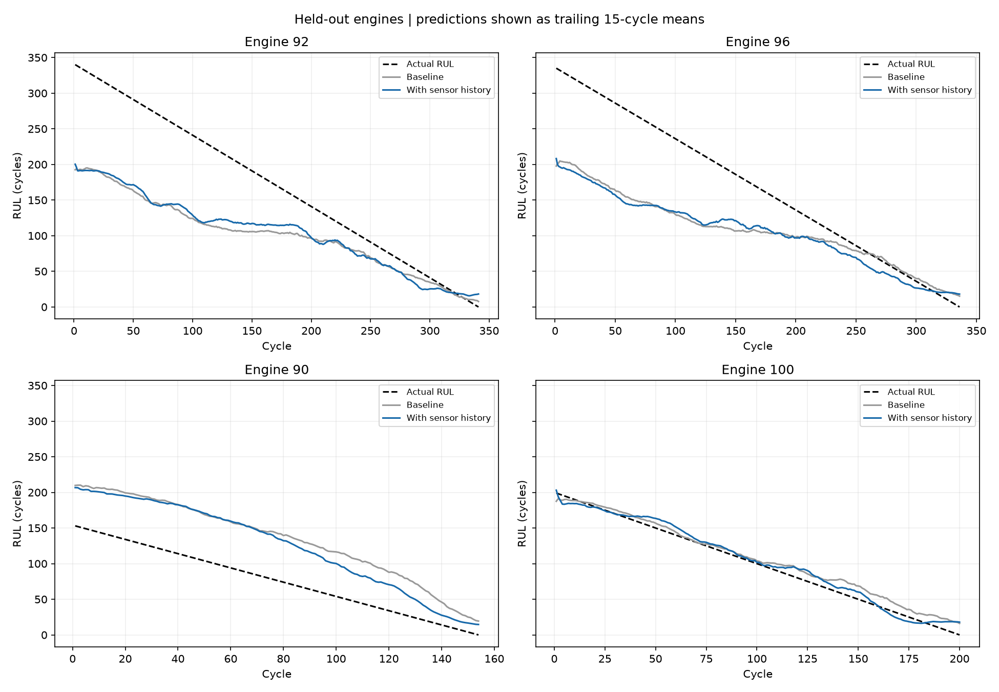

# On-device predictive maintenance: прогноз Remaining Useful Life двигателя

Исследовательский ML-проект для прогнозирования оставшегося количества рабочих циклов двигателя — **Remaining Useful Life, RUL**. Данные: `FD001` из набора C-MAPSS. Одна строка соответствует одному двигателю на одном рабочем цикле.

Цель проекта — пройти полный регрессионный эксперимент: исследовать данные, сформировать target для каждой строки, разделить двигатели между train и validation, сравнить модели, разобрать ошибки отдельных траекторий и добавить признаки истории сенсоров.

Название рабочей папки сохранилось от предыдущего проекта с недвижимостью. Текущий README описывает эксперимент с двигателями. Старые артефакты недвижимости в корневых `dataset/` и `models/` не используются текущими скриптами.

**Итог экспериментов:** среди моделей с зафиксированными результатами лучший validation RMSE показала **PolynomialFeatures degree 3 + Ridge + история сенсоров**: **44.707050 цикла**, MAE **31.638485**. Без истории та же Ridge получила RMSE **47.946897**. Добавление истории улучшило RMSE примерно на **6.76%**.

Это выбор модели по текущему validation. Независимая итоговая оценка на отдельном test пока не проведена. Название on-device описывает направление проекта; скорость, память и работа на целевом оборудовании ещё не измерялись.

## Содержание

1. [Task Description и Dataset Raw Info](#task-description)
2. [Target Analysis](#target-analysis)
3. [Data Validation и EDA](#data-validation-и-eda)
4. [Split Strategy и оценка моделей](#split-strategy-и-оценка-моделей)
5. [Iteration 1: исходные признаки и модели](#iteration-1-исходные-признаки-и-модели)
6. [Iteration 2: дополнительное удаление признаков](#iteration-2-дополнительное-удаление-признаков)
7. [Iteration 3: Group Evaluation](#iteration-3-group-evaluation)
8. [Iteration 4: траектории двигателей](#iteration-4-траектории-двигателей)
9. [Iteration 5: Feature Engineering с историей](#iteration-5-feature-engineering-с-историей)
10. [Iteration 6: бустинг с историей](#iteration-6-бустинг-с-историей)
11. [Итоговый выбор модели](#итоговый-выбор-модели)
12. [Конспект Feature Engineering](#конспект-feature-engineering)
13. [Код, запуск и воспроизводимость](#код-запуск-и-воспроизводимость)

## Task Description

Обучающие траектории содержат измерения до конца наблюдаемой жизни двигателя. Нужно научиться предсказывать количество циклов, оставшихся до отказа, по информации, доступной на текущем цикле.

Тестовые траектории обрываются до отказа. Для них предоставлен отдельный вектор RUL на последнем наблюдаемом цикле.

### Dataset Raw Info

| Характеристика | Значение |
| --- | --- |
| Единица прогноза | Один рабочий цикл одного двигателя |
| Количество строк | 20 631 |
| Количество исходных колонок | 26 |
| Количество двигателей в обучающем файле | 100 |
| Формат | Числовые значения, разделённые пробелами |
| Target | Оставшееся количество циклов, `RUL` |

В коде используется **нумерация колонок с нуля**. Поэтому feature №1 — текущий цикл, а не ID двигателя.

| Колонка | Назначение |
| --- | --- |
| `0` | ID двигателя |
| `1` | Текущий рабочий цикл |
| `2`, `3`, `4` | Три рабочих параметра |
| `5`–`25` | 21 показание сенсоров |

26 колонок не означают 26 сенсоров: в это число входят ID, цикл и рабочие параметры.

### Файлы данных

- [train_FD001.txt](scripts/train_FD001.txt): полные обучающие траектории, из которых формируются наши train и validation.
- [RUL_FD001.txt](scripts/RUL_FD001.txt): остаточный ресурс тестовых двигателей на последнем наблюдаемом цикле.
- Отдельный файл тестовых траекторий сейчас не включён в текущий запуск.

## Target Analysis

### RUL для каждой строки обучающей траектории

Для двигателя `e` и текущего цикла `t`:

```text
RUL(e, t) = max_cycle(e) - current_cycle(e, t)
```

Пример:

| engine_id | current_cycle | max_cycle | RUL |
| ---: | ---: | ---: | ---: |
| 92 | 1 | 341 | 340 |
| 92 | 100 | 341 | 241 |
| 92 | 341 | 341 | 0 |

`max_cycle` применяется для формирования обучающих labels. В модель эта величина не передаётся: при реальном прогнозе будущая длительность жизни двигателя неизвестна.

Samples, targets и служебные engine IDs находятся в одной `DatasetEntity`. Исходные индексы строк сохраняются при split, cleaning и добавлении истории. Это позволяет проверять, что target остался сопоставлен правильному sample.

### Поправка к первоначальному PDF

В PDF статистика `mean=75.52`, `std≈41.56`, диапазон `7–145` относится к значениям файла `RUL_FD001.txt`. Это **остаточный ресурс на концах тестовых траекторий**, а не общее время работы обучающих двигателей и не распределение targets всех обучающих строк.

Для обрезанной тестовой траектории с последним циклом `T_observed` и известным тестовым label `RUL_last` правильная формула target более ранней строки:

```text
RUL(t) = T_observed - t + RUL_last
```

Просто `T_observed - t` ошибочно приравняло бы конец тестового наблюдения к отказу. Текущий `DatasetEntity` предназначен для полных обучающих траекторий; напрямую применять его к обрезанному test нельзя.

### Распределение targets текущего эксперимента

| Выборка | Строк | Mean RUL | STD RUL, ddof=0 | Min | Max |
| --- | ---: | ---: | ---: | ---: | ---: |
| Весь обучающий файл | 20 631 | 107.81 | 68.88 | 0 | 361 |
| Train, двигатели 1–80 | 16 138 | 104.55 | 65.91 | 0 | 361 |
| Validation, двигатели 81–100 | 4 493 | 119.52 | 77.49 | 0 | 340 |

На validation средний RUL выше и распределение шире. Это один из факторов, который нужно учитывать при интерпретации разрыва train/validation. Один такой разрыв сам по себе не доказывает overfitting.

## Data Validation и EDA

### Data Validation

В исходном обучающем файле:

- Missing values: **0**.
- Duplicate rows: **0**.
- ID двигателя нужен для построения target, split, истории и групповой оценки.
- После split ID удаляется из обучающих features и остаётся отдельной служебной Series.

ID — идентификатор конкретного объекта. Его числовой порядок не имеет физического смысла для прогнозирования ресурса нового двигателя.

### Features Sorted by STD / Variance

В первоначальном EDA сравнивались variances колонок. Текущий анализатор сортирует признаки по стандартному отклонению. Для одинакового набора данных порядок по STD и variance совпадает, поскольку `variance = STD²`.

Примеры исходной variance из PDF:

| Feature | Variance | Наблюдение |
| ---: | ---: | --- |
| 1 | 4744.360834 | Рабочий цикл, большой диапазон |
| 13 | 487.629931 | Меняется между строками и траекториями |
| 18 | 363.882851 | Меняется между строками и траекториями |
| 15 | 0.071332 | Малая абсолютная variance |
| 25 | 0.011718 | Малая абсолютная variance |
| 17 | 0.005172 | Кандидат для эксперимента с удалением |
| 12 | 0.005039 | Кандидат для эксперимента с удалением |
| 9 | ≈2.84e−29 | Практически постоянная колонка |
| 20 | ≈1.20e−35 | Практически постоянная колонка |
| 4, 5, 14, 22, 23 | 0 | Постоянные колонки |

**ИТОГ:** строго постоянный признак не помогает различать samples. Но маленькая абсолютная variance не доказывает отсутствие информации: признаки измеряются в разных единицах. Например, feature 15 имеет маленькую variance, но её траектория полезна для анализа состояния двигателя.

Поэтому дополнительные удаления ниже описываются как эксперимент с отбором признаков, а не как доказанное устранение noise.

### Correlation Features

В первоначальном EDA всего файла были найдены пары с `abs(Pearson corr) ≥ 0.8`:

| Пара features | Correlation |
| --- | ---: |
| 13 ↔ 18 | +0.963157 |
| 15 ↔ 16 | −0.846884 |
| 8 ↔ 15 | +0.830136 |
| 12 ↔ 17 | +0.826084 |
| 11 ↔ 15 | −0.822805 |
| 8 ↔ 16 | −0.815591 |
| 11 ↔ 16 | +0.812713 |

На scatter `12 ↔ 17` видны полосы и дискретная сетка. Это совместимо с округлением или квантованием измерений, но по одному графику нельзя установить механизм получения данных.

Корреляция между признаками не означает автоматически, что один из них нужно удалить. Для линейных моделей она может усложнять устойчивую оценку отдельных коэффициентов; Ridge уменьшает чувствительность к этому через регуляризацию. Полезность удаления всё равно проверяется метриками.

### Grouped Statistics: корреляции внутри двигателей

Общая корреляция может смешивать две разные вещи: различия между двигателями и изменения внутри одной траектории. Поэтому статистика считалась отдельно по ID двигателя.

Некоторые результаты первоначального группового анализа из PDF:

| Пара | Median corr | STD corr между двигателями | Доля сильных пар | Стабильность знака |
| --- | ---: | ---: | ---: | --- |
| cycle 1 ↔ sensor 15 | +0.816 | 0.040 | 68% | 100% положительный |
| cycle 1 ↔ sensor 16 | −0.811 | 0.053 | 57% | 100% отрицательный |
| sensor 15 ↔ sensor 16 | −0.799 | 0.069 | 50% | 100% отрицательный |
| sensor 8 ↔ sensor 15 | +0.781 | 0.057 | 42% | 100% положительный |
| cycle 1 ↔ sensor 8 | +0.790 | 0.038 | 38% | 100% положительный |

У пары `13 ↔ 18` общий Pearson около `0.963`, но внутри отдельных двигателей связь заметно менее однородна. В PDF для этой пары приведены mean `0.651893`, median `0.742501` и STD `0.340804`. В его краткой таблице значение mean оказалось подписано как median; здесь эти величины разделены.

**ИТОГ:** некоторые сенсоры имеют устойчивое направление изменения с циклом. Другие меняются по-разному у разных двигателей. Это основание изучать траектории, а не только общую матрицу корреляций.

Первоначальный EDA включал весь обучающий файл, в том числе будущую validation-часть. Поэтому этот этап является исследовательским. Для полностью независимого следующего эксперимента решения об отборе features нужно принимать внутри train, а финальную проверку проводить на нетронутом test.

## Split Strategy и оценка моделей

### Разделение по двигателям

```text
Engine IDs 1–80   → train
Engine IDs 81–100 → validation
Отдельные тестовые траектории → будущая независимая test-оценка
```

Случайный split отдельных строк позволил бы соседним циклам одного двигателя попасть в разные выборки. Модель тогда проверялась бы частично на уже знакомых объектах. Здесь проверяется перенос на двигатели, которых не было в train.

### GroupKFold внутри train

В текущем коде все модели с GridSearchCV используют `GroupKFold(n_splits=5)` с engine IDs из train.

Для каждой комбинации гиперпараметров:

1. Четыре группы фолдов используются для обучения.
2. Оставшийся фолд используется для оценки.
3. Ни один двигатель не разделяется между train и holdout одного фолда.
4. RMSE усредняется по пяти фолдам.
5. Лучшая комбинация заново обучается на всём train.
6. После этого рассчитываются predictions и метрики validation.

Scaler находится внутри sklearn Pipeline. Он обучается только на обучающей части соответствующего фолда. Validation не используется для выбора `alpha`, числа соседей или параметров деревьев.

В историческом PDF не сохранены полные составы фолдов всех ранних запусков. Поэтому ранние CV-числа приведены как зафиксированные результаты тех запусков. Для парных экспериментов с историей одинаковый групповой протокол подтверждён кодом и сохранёнными scores каждого фолда.

### Regression Metrics

Везде residual определяется как:

```text
residual = prediction - target
```

| Метрика | Формула / смысл |
| --- | --- |
| RSS | `sum(residual²)`: суммарная квадратичная ошибка |
| RMSE | `sqrt(mean(residual²))`: ошибка в рабочих циклах, чувствительна к большим промахам |
| MAE | `mean(abs(residual))`: средняя абсолютная ошибка в циклах |
| RMSE / STD(target) | Ошибка относительно разброса target; STD считается с `ddof=0` |
| RMSE / MinMax(target) | Ошибка относительно `max(target) − min(target)` |
| Mean residual / bias | Отрицательный — систематическая недооценка; положительный — переоценка |

RSS зависит от количества строк, поэтому непосредственно сравнивать RSS групп разного размера неудобно. RMSE удобнее для сравнения, а RSS показывает вклад группы в общую сумму ошибки.

Для постоянного target нормированные метрики не определены; код выводит это явно.

### Evaluation Plots

**Prediction vs Target Scatter Plot:** по X располагается фактический RUL, по Y — prediction. Диагональ соответствует точному прогнозу. Точки ниже диагонали означают недооценку ресурса.

**Residual Histogram:** отрицательный хвост означает сильные недооценки RUL. Пик около нуля не гарантирует низкий RMSE: относительно небольшое количество больших ошибок может заметно увеличить квадрат ошибки.

Кривизна scatter показывает структурированную ошибку. Она может возникать из-за недостаточной формы модели, недостаточных features или различий объектов. Один график не позволяет однозначно выбрать причину.

## Iteration 1: исходные признаки и модели

### Data Cleaning & Scaling

Удалены постоянные features `4, 5, 14, 22, 23`. После разделения удалён ID `0`. В модели осталось **20 признаков**.

Для LinearRegression и KNN использовался StandardScaler. Для polynomial-моделей масштабирование выполняется до polynomial expansion и после него. Деревья и бустинг работают с исходными числовыми шкалами.

### Model Training

Числа этого раздела взяты из первоначального PDF. Там, где подробное значение не сохранено, используется округлённое значение или `—`.

| Модель | Train RMSE | Validation RMSE | Validation MAE | CV RMSE |
| --- | ---: | ---: | ---: | ---: |
| Dummy, среднее train target | 65.913253 | 78.925103 | 64.089337 | — |
| LinearRegression | 36.586135 | 53.137159 | 42.389842 | — |
| PolynomialFeatures degree 2 + Ridge | 32.508507 | 48.361719 | 35.864467 | — |
| KNN | — | 48.546618 | 34.808159 | — |
| DecisionTree | 33.55 | 50.08 | 36.31 | 34.72 |
| GradientBoosting | 31.71 | 48.23 | 34.88 | 33.32 |

### DummyRegression

Dummy предсказывает средний target train — около `104.55` цикла — для каждого sample. Это точка отсчёта: обучаемая модель должна давать полезное улучшение относительно постоянного прогноза.

На train `RMSE / STD(target) = 1`, что ожидаемо для предсказания среднего по тем же данным.

### LinearRegression

Validation RMSE снизился с `78.93` до `53.14`, примерно на **32.7%**. В features есть информация, позволяющая предсказывать RUL лучше среднего.

Scatter имел заметную кривизну. При большом фактическом RUL модель часто давала существенно меньший prediction. На histogram сохранялся длинный отрицательный хвост.

**ИТОГ:** линейная модель полезна как baseline, но текущая форма зависимости и представление данных оставляют структурированную ошибку. Следующий эксперимент — polynomial features и регуляризация.

### PolynomialFeatures degree 2 + Ridge

Лучший сохранённый `alpha=100`. Validation RMSE снизился с `53.14` до `48.36`, примерно на **9%**.

PolynomialFeatures добавляет квадраты и взаимодействия признаков. Ridge ограничивает величины коэффициентов расширенного пространства. Зависимость от исходных features становится нелинейной, хотя регрессия остаётся линейной по сгенерированным признакам.

Scatter стал ближе к диагонали, но сохранились отдельные ветки и недооценка большого RUL.

**ИТОГ:** расширение features оказалось полезным. Видимые ветки — повод провести Group Evaluation, но они сами по себе не доказывают наличие отдельных типов двигателей.

### KNN

Validation RMSE `48.55` практически не улучшил Ridge. При небольшом RUL разброс был меньше; при большом RUL оставались сильные недооценки.

Близость по текущим сенсорам не обязательно означает близость по оставшемуся ресурсу. Усреднение соседей также сглаживает отдельные ветки на scatter.

**ИТОГ:** локальные соседи в текущем пространстве features не решили проблему раннего большого RUL. Следующий шаг — проверить разбиение пространства деревьями.

### DecisionTree

Лучшие параметры в PDF: `max_depth=5`, `min_samples_leaf=50`, `min_samples_split=2`. Validation RMSE `50.08` хуже Ridge и KNN.

**ИТОГ:** одно дерево не дало выигрыша. Проверяем ансамбль деревьев — GradientBoosting.

### GradientBoosting

Лучшие параметры: `n_estimators=100`, `learning_rate=0.05`, `max_depth=3`. Validation RMSE `48.23` немного лучше Ridge degree 2.

**ИТОГ Iteration 1:** усложнение модели улучшило baseline, но результаты нескольких разных методов оказались рядом. Возникла гипотеза, что дальнейший выигрыш требует изменения признаков, а не только смены регрессора.

## Iteration 2: дополнительное удаление признаков

### Data Cleaning

Дополнительно исключены features:

```text
20, 9, 3, 10, 2, 19, 12, 17
```

Полный список исключённых колонок текущего cleaning:

```text
0, 2, 3, 4, 5, 9, 10, 12, 14, 17, 19, 20, 22, 23
```

Осталось **12 исходных features**:

```text
1, 6, 7, 8, 11, 13, 15, 16, 18, 21, 24, 25
```

Это текущий цикл и 11 сенсорных колонок. Коррелирующие features не удалялись отдельным новым этапом после этой итерации.

### Model Training

| Модель | Train RMSE | Validation RMSE | Validation MAE | CV RMSE |
| --- | ---: | ---: | ---: | ---: |
| LinearRegression, 12 features | 36.653670 | 53.218795 | 42.475526 | — |
| PolynomialFeatures degree 3 + Ridge, 12 features | 32.282823 | 47.946897 | 35.065743 | 33.246889 |
| PolynomialFeatures degree 2 + KNN, 12 features | — | 49.26 | 35.23 | 34.30 |

В PDF результат Ridge `47.946897` подписан как degree 2. Последующий сохранённый baseline degree 3 воспроизвёл эти же метрики и использовался для сравнения с историей. В README этот эксперимент указан как **degree 3**. Метки ранних ручных запусков без сохранённой конфигурации нельзя считать отдельным подтверждённым экспериментом degree 2.

Для polynomial KNN сохранена схема `Scaler → PolynomialFeatures(degree=2) → Scaler → KNN`. GridSearchCV выбрал `n_neighbors=100`, `weights=distance`. 12 исходных признаков превратились в 90 polynomial-признаков.

PolynomialLasso также реализована в репозитории; в текущем коде у неё degree 3. В PDF и сохранённых отчётах нет её итоговых validation-метрик. Поэтому она не получает выдуманное место в рейтинге.

**ИТОГ:** после удаления features LinearRegression почти не изменилась, а Ridge показала небольшой выигрыш. Но одновременно менялась степень polynomial expansion, поэтому весь выигрыш Ridge нельзя приписать только удалению features. Систематический ablation каждого удалённого признака не проводился.

## Iteration 3: Group Evaluation

### Зачем разделять результаты по двигателям

Общий validation RMSE `47.95` скрывает очень разное качество на отдельных объектах. Для проверки этого обучена **одна общая PolynomialRidge degree 3** на двигателях 1–80, а predictions двигателей 81–100 сгруппированы по ID.

**Отдельная модель на каждом validation-двигателе не обучалась.** Group Evaluation — это разделение результатов одной модели, а не двадцать персональных обучений. Validation-двигатели остаются неизвестными при обучении.

### Метрики группы

Для каждого двигателя рассчитаны:

- Количество строк.
- RSS, RMSE и MAE.
- RMSE / STD и RMSE / range внутри группы.
- Средний residual: направление систематической ошибки.
- Максимальная абсолютная ошибка.
- В экспериментах истории: bias первых 25 и последних 30 наблюдений.

### Итог по всем validation-двигателям до добавления истории

Источник: [validation_metrics.txt](reports/polynomial_ridge_by_engine/validation_metrics.txt). Таблица отсортирована от худшего RMSE к лучшему.

| Engine ID | Строк / циклов | RMSE | MAE | Mean residual |
| ---: | ---: | ---: | ---: | ---: |
| 92 | 341 | 86.88 | 70.47 | −66.42 |
| 96 | 336 | 78.49 | 62.42 | −58.17 |
| 84 | 267 | 60.85 | 52.90 | −52.22 |
| 86 | 278 | 57.42 | 48.66 | −47.76 |
| 90 | 154 | 54.50 | 51.85 | +51.68 |
| 94 | 258 | 52.19 | 44.94 | −44.31 |
| 95 | 283 | 47.53 | 37.66 | −32.86 |
| 93 | 155 | 45.66 | 43.43 | +43.43 |
| 83 | 293 | 44.10 | 36.96 | −19.94 |
| 98 | 156 | 43.41 | 41.44 | +41.44 |
| 91 | 135 | 36.11 | 33.61 | +33.60 |
| 81 | 240 | 31.53 | 26.52 | −25.86 |
| 99 | 185 | 25.39 | 23.51 | +22.74 |
| 97 | 202 | 18.38 | 15.69 | +13.91 |
| 87 | 178 | 14.63 | 12.95 | +12.67 |
| 85 | 188 | 14.55 | 12.46 | +11.98 |
| 89 | 217 | 14.33 | 11.09 | +8.21 |
| 82 | 214 | 12.40 | 9.78 | +6.38 |
| 88 | 213 | 10.44 | 8.45 | −6.44 |
| 100 | 200 | 8.02 | 6.31 | −0.97 |

### Как правильно объединять группы

Общий RMSE по строкам:

```text
global_RMSE = sqrt(sum(engine_RSS) / sum(engine_rows))
```

Это не среднее RMSE двадцати двигателей. Длинные траектории получают больший вес, потому что содержат больше samples.

Для baseline:

| Способ агрегации | Результат |
| --- | ---: |
| Общий RMSE по всем validation-строкам | 47.95 |
| Среднее RMSE двигателей, равный вес каждому | 37.84 |
| Доля validation RSS двигателей 92 и 96 вместе | ≈44.96% |

**ИТОГ:** два длинных двигателя формируют почти половину суммарной квадратичной ошибки. Значит, разбор именно этих траекторий может объяснить гораздо больше, чем очередная небольшая смена гиперпараметров.

### Есть ли корреляция ошибки с ID двигателя

Для этих двадцати групп:

| Связь | Pearson correlation |
| --- | ---: |
| Числовой ID ↔ RMSE | +0.089 |
| Длительность жизни ↔ mean residual | −0.939 |

Сильной линейной связи ошибки с **числовым номером** двигателя не обнаружено. Обнаружено другое: длинные траектории чаще недооцениваются, короткие — переоцениваются.

ID помог обнаружить различия групп, но физической причиной ошибки он не является. Возможные причины связаны с начальными состояниями, динамикой сенсоров и информацией, которую текущие features не отражают. Эти корреляции описывают данную validation-выборку и не доказывают причинность.

## Iteration 4: траектории двигателей

Для подробного анализа выбраны:

- `92`: худшая группа, сильная недооценка.
- `96`: ещё одна длинная проблемная траектория.
- `90`: короткая траектория с противоположной ошибкой — переоценкой.
- `100`: удачная группа, которую желательно сохранить при улучшениях.

### Predictions во времени

| Engine | Длина траектории | RMSE | Средний true RUL первых 25 циклов | Средний prediction первых 25 | Bias первых 25 |
| ---: | ---: | ---: | ---: | ---: | ---: |
| 92 | 341 | 86.88 | 328.0 | 196.05 | −131.95 |
| 96 | 336 | 78.49 | 323.0 | 201.16 | −121.84 |
| 90 | 154 | 54.50 | 141.0 | 203.71 | +62.71 |
| 100 | 200 | 8.02 | 187.0 | 187.70 | +0.70 |

Модель начинает несколько разных траекторий с прогнозов около 190–204 циклов. Реальный остаточный ресурс в начале этих двигателей сильно различается. К концу работы forecasts значительно сближаются с true RUL.

**ИТОГ:** проблема особенно выражена в ранней части жизни двигателя. Модель лучше распознаёт близость к отказу, чем индивидуальный большой начальный ресурс.



### Что показали сенсоры

Изучались начальные уровни, ранние и поздние наклоны, а также изменения сигналов во времени. Для сравнения графиков использовано масштабирование по mean/std только train. Сглаживание графиков выполнялось trailing mean за 15 циклов.

Особенно заметны различия сенсоров `13` и `18`: у `92` они растут, у `90` могут снижаться. Сенсоры `15` и `16` имеют более устойчивые направления, но скорость изменения отличается между двигателями и участками траектории.

Начальный уровень измерения тоже различается. Поэтому одинаковое абсолютное показание сенсора у двух двигателей может означать разную степень изменения относительно собственного начала.



### Ретроспективные изменения наклона

Для feature `15` дополнительно построена непрерывная кусочно-линейная аппроксимация с одной точкой изменения наклона.

| Engine | Найденный цикл изменения наклона | Снижение SSE относительно одной прямой |
| ---: | ---: | ---: |
| 92 | 231 | 40.54% |
| 96 | 228 | 44.71% |
| 90 | 112 | 45.34% |
| 100 | 134 | 39.31% |

Это **ретроспективная диагностическая оценка**, использующая всю траекторию. Она не является размеченным моментом возникновения неисправности. Эти точки не передавались модели как features.

Источник подробных чисел: [trajectory_analysis.txt](reports/engine_trajectory_analysis/trajectory_analysis.txt).

**Гипотеза следующего эксперимента:** текущего значения сенсора недостаточно. Скорость изменения, устойчивый уровень, колебания и отклонение от собственного начала помогут различать траектории.

## Iteration 5: Feature Engineering с историей

### Какие features решил создать и почему

История добавлена для всех 11 оставшихся сенсорных features:

```text
6, 7, 8, 11, 13, 15, 16, 18, 21, 24, 25
```

Для каждого сенсора созданы:

| Feature family | Окна | Какую информацию добавляет | Почему выбрана |
| --- | --- | --- | --- |
| Rolling mean | 10 и 30 циклов | Устойчивый недавний уровень | Текущая точка может быть шумным отклонением |
| Rolling STD | 10 и 30 циклов | Изменчивость сигнала | Одинаковый mean может сопровождаться разной нестабильностью |
| Rolling slope | 10 и 30 циклов | Направление и скорость изменения | Одинаковое текущее значение может быть частью растущей или падающей траектории |
| Delta from initial | Начальная база до 25 наблюдений | Изменение относительно своего начала | У двигателей различаются исходные уровни сенсоров |

На один сенсор получилось `2 × 3 + 1 = 7` новых features. Всего `11 × 7 = 77`. Вместе с исходными 12 колонками — **89 входных features**.

Имена колонок показывают формулу:

```text
sensor_15_mean_10
sensor_15_std_30
sensor_15_slope_10
sensor_15_delta_initial
```

### Rolling mean: уровень состояния

Среднее последних доступных наблюдений окна:

```text
mean_w(t) = average(sensor values in the last w observations up to t)
```

Одиночный скачок измерения меньше влияет на mean, чем на текущую точку. Feature помогает модели видеть устойчивое изменение уровня.

### Rolling STD: нестабильность

```text
std_w(t) = standard deviation of the same window, ddof=0
```

Стабильный сигнал и сильно колеблющийся сигнал могут иметь одинаковый mean. STD разделяет эти ситуации.

Рост STD не обязательно означает деградацию: он может описывать измерительный шум или режим работы. Поэтому это кандидат для проверки, а не гарантированный индикатор неисправности.

### Rolling slope: скорость изменения

Наклон прямой, аппроксимирующей измерения в окне:

```text
slope_w(t) = covariance(cycle, sensor) / variance(cycle)
```

Используются все точки окна. Это позволяет оценить общий тренд вместо чувствительной к шуму разности двух соседних измерений. Единицы feature — изменение значения сенсора за рабочий цикл.

Если история пока состоит из одной точки, наклон задаётся равным нулю: направление изменения ещё невозможно оценить.

### Delta from initial: индивидуальная точка отсчёта

```text
delta_initial(t) = current_sensor_value - initial_mean(t)
```

До 25-го наблюдения initial mean считается по уже доступному префиксу. Начиная с 26-го наблюдения используется зафиксированное среднее первых 25 измерений.

Пример:

| Engine | Начальная база | Текущее значение | Delta |
| --- | ---: | ---: | ---: |
| A | 100 | 110 | +10 |
| B | 108 | 110 | +2 |

Текущее значение одинаковое, относительное изменение разное. Начальная база означает начало наблюдения; она не гарантированно соответствует полностью здоровому состоянию двигателя.

### Почему окна 10 и 30

Окно 10 даёт более быструю реакцию на недавние изменения. Окно 30 описывает более устойчивую тенденцию, но реагирует медленнее. Две временные шкалы позволяют модели использовать обе характеристики.

Числа `10`, `30` и `25` выбраны как стартовые настройки гипотезы. Их оптимальность не доказана; они не подбирались по validation.

В реализации окна считаются по **последним 10/30 наблюдениям**. В текущем FD001 циклы идут последовательно, поэтому это соответствует 10/30 циклам. При пропущенных циклах такая эквивалентность исчезнет: для нового источника данных понадобится другой способ окон или обработка пропусков.

### Защита от утечки

История рассчитывается отдельно внутри каждого двигателя, после сортировки по циклу. В окнах есть только текущая и предыдущие точки. Строки затем возвращаются к исходному порядку.

Для прогноза на цикле 15 нельзя использовать среднее первых 25 измерений целиком: десять из них находятся в будущем. Поэтому ранняя initial mean расширяется только по доступному префиксу.

Будущая длительность жизни, конечные значения сенсоров и ретроспективный момент изменения наклона в features не включаются.

Проверка причинной доступности выполнена двумя способами: изменение будущих сенсоров не меняет прошлые features; результат для обрезанного префикса совпадает с соответствующим префиксом полного ряда.

### Pipeline модели с историей

```text
Исходные 12 features
    → StandardScaler
    → PolynomialFeatures(degree=3, include_bias=False)
    → StandardScaler
    → 454 features

77 features истории
    → StandardScaler
    → 77 features

Оба блока
    → объединение: 531 features
    → Ridge
    → GridSearchCV, GroupKFold(5)
```

Polynomial expansion применяется **только к исходным 12 features**. История добавляется линейным блоком. Полное degree 3 расширение всех 89 колонок создало бы 125 579 features; в этом эксперименте такое расширение не использовалось.

Grid для alpha одинаковый у baseline и history:

```text
0.001, 0.01, 0.1, 1, 10, 100, 1000, 10000
```

Все scaler обучаются внутри CV. История может рассчитываться до CV, поскольку каждый её ряд использует только собственное прошлое двигателя, а GroupKFold переносит весь двигатель в один фолд. Общая статистика других двигателей в историю не попадает.

### Model Training: одинаковые фолды и target

| Модель | Лучшая alpha | CV RMSE | Train RMSE | Validation RMSE | Validation MAE |
| --- | ---: | ---: | ---: | ---: | ---: |
| PolynomialRidge degree 3 без истории | 100 | 33.246889 | 32.282823 | 47.946897 | 35.065743 |
| PolynomialRidge degree 3 с историей | 1000 | 31.409748 | 29.703406 | **44.707050** | **31.638485** |

История улучшила validation RMSE на **6.76%**, MAE примерно на **9.78%**. Средний RMSE двигателей с равным весом каждой группы снизился с **37.84** до **35.36**. Средний CV RMSE тоже улучшился; у выбранных конфигураций улучшение наблюдается на всех пяти фолдах.

### Итог по группам после добавления истории

| Engine | Ridge без истории, RMSE | Ridge с историей, RMSE |
| ---: | ---: | ---: |
| 81 | 31.53 | 29.19 |
| 82 | 12.40 | 14.23 |
| 83 | 44.10 | 40.10 |
| 84 | 60.85 | 54.67 |
| 85 | 14.55 | 16.64 |
| 86 | 57.42 | 55.21 |
| 87 | 14.63 | 14.02 |
| 88 | 10.44 | 9.58 |
| 89 | 14.33 | 11.96 |
| 90 | 54.50 | 49.08 |
| 91 | 36.11 | 28.72 |
| 92 | 86.88 | 80.50 |
| 93 | 45.66 | 44.96 |
| 94 | 52.19 | 47.40 |
| 95 | 47.53 | 43.94 |
| 96 | 78.49 | 75.56 |
| 97 | 18.38 | 20.50 |
| 98 | 43.41 | 37.04 |
| 99 | 25.39 | 24.63 |
| 100 | 8.02 | 9.29 |

Улучшение есть у 16 из 20 двигателей. У `82`, `85`, `97` и `100` RMSE вырос. Требование сохранить качество `100` полностью выполнить не удалось: ухудшение с `8.02` до `9.29` нужно учитывать при выборе модели.



**ИТОГ:** история содержит полезную дополнительную информацию. Однако сильная недооценка раннего RUL длинных двигателей сохраняется. Пакетный эксперимент не доказывает, что каждый из 77 features полезен: вклад отдельных семейств ещё не выделен.

Источники: [aggregate_metrics.txt](reports/sensor_history_experiment/aggregate_metrics.txt), [engine_metrics.txt](reports/sensor_history_experiment/engine_metrics.txt), [CV results](reports/sensor_history_experiment/cv_results.txt), [условия эксперимента](reports/sensor_history_experiment/experiment_notes.txt).

## Iteration 6: бустинг с историей

Следующая гипотеза: история полезна, но её связь с RUL может лучше описываться нелинейным ансамблем. Сравнивается один и тот же GradientBoostingRegressor на 12 исходных features и на 89 features с историей.

Target, split и GroupKFold(5) сохранены. Validation не участвует в выборе параметров.

### GridSearchCV

```text
n_estimators:     100, 200
learning_rate:   0.05, 0.1
max_depth:       2, 3

min_samples_leaf = 10
random_state = 42
```

Восемь комбинаций на пяти фолдах — 40 CV fits для каждой версии. После подбора лучшая модель переобучается на всём train. Scaler и polynomial expansion не применяются.

### Model Training

| Модель | Лучшие параметры | CV RMSE | Train RMSE | Validation RMSE | Validation MAE |
| --- | --- | ---: | ---: | ---: | ---: |
| Бустинг без истории, 12 features | 100 trees, lr 0.05, depth 3 | 33.354704 | 31.802509 | 48.350547 | 34.999416 |
| Бустинг с историей, 89 features | 100 trees, lr 0.05, depth 2 | 32.395441 | 28.898046 | **45.738542** | **32.276301** |

История снизила validation RMSE бустинга примерно на **5.40%**. Тем не менее, Ridge с историей осталась лучше по RMSE и MAE.

### Оценка четырёх выбранных групп

| Engine | Бустинг без истории, RMSE | Бустинг с историей, RMSE |
| ---: | ---: | ---: |
| 90 | 52.25 | 45.10 |
| 92 | 88.15 | 84.36 |
| 96 | 81.88 | 83.20 |
| 100 | 9.16 | 9.68 |

У `90` и `92` ошибка снизилась. У `96` и `100` немного выросла. Среднее улучшение модели не означает улучшения каждой группы.

### Оценка по диапазонам true RUL

| True RUL | Строк validation | RMSE без истории | RMSE с историей | Bias с историей |
| --- | ---: | ---: | ---: | ---: |
| 0–30 | 620 | 11.82 | **8.29** | +4.70 |
| 31–100 | 1400 | 27.49 | 23.59 | +7.22 |
| 101–200 | 1743 | 41.47 | 36.63 | −10.88 |
| >200 | 730 | 93.35 | **92.45** | −86.17 |

При малом RUL история помогает заметно. При RUL выше 200 сильная недооценка практически не устранена.

**ИТОГ:** уровень RMSE 8–10 уже наблюдается около отказа в этой версии бустинга. Для всех циклов целиком такой уровень не достигнут. Этот диапазонный результат нельзя выдавать за общий validation RMSE или за результат отдельного test.



Все trajectory comparison plots используют trailing mean predictions за 15 циклов для удобства просмотра. Метрики рассчитаны по **исходным несглаженным predictions**.

Источники: [aggregate_metrics.txt](reports/boosting_history_experiment/aggregate_metrics.txt), [engine_metrics.txt](reports/boosting_history_experiment/engine_metrics.txt), [rul_range_metrics.txt](reports/boosting_history_experiment/rul_range_metrics.txt), [CV results](reports/boosting_history_experiment/cv_results.txt).

## Итоговый выбор модели

### Рейтинг всех экспериментов с сохранённым validation RMSE

| Место | Эксперимент | Validation RMSE | Источник |
| ---: | --- | ---: | --- |
| 1 | **Ridge degree 3 + 77 features истории** | **44.707050** | Сохранённый парный эксперимент |
| 2 | Бустинг + 77 features истории | 45.738542 | Сохранённый парный эксперимент |
| 3 | Ridge degree 3, 12 исходных features | 47.946897 | Сохранённый baseline |
| 4 | Бустинг, 20 исходных features | 48.23 | PDF, округлено |
| 5 | Бустинг, 12 исходных features | 48.350547 | Сохранённый baseline |
| 6 | Ridge degree 2, 20 исходных features | 48.361719 | PDF |
| 7 | KNN, 20 исходных features | 48.546618 | PDF |
| 8 | Polynomial KNN degree 2, 12 features | 49.26 | PDF, округлено |
| 9 | DecisionTree, 20 features | 50.08 | PDF, округлено |
| 10 | LinearRegression, 20 features | 53.137159 | PDF |
| 11 | LinearRegression, 12 features | 53.218795 | PDF |
| 12 | Dummy | 78.925103 | PDF |

Таблица показывает историю проекта, включая разные наборы features. Она не изолирует влияние каждого отдельного изменения. Самые убедительные сравнения — парные эксперименты с одинаковым split, фолдами и сеткой параметров.

Для PolynomialLasso отсутствует сохранённый итог, поэтому утверждать, что она хуже победителя, нельзя. Победитель выбран **среди экспериментов с зафиксированными результатами**.

### Модель, которую выбираю по текущему validation

**HistoryPolynomialRidge**:

- PolynomialFeatures degree 3 на 12 исходных features.
- 77 причинно доступных features истории.
- StandardScaler внутри Pipeline для каждого блока.
- Ridge с выбранной `alpha=1000`.
- GroupKFold(5), двигатели train как groups.

| Validation metric | Результат |
| --- | ---: |
| RMSE | **44.707050** |
| MAE | **31.638485** |
| RSS, восстановлено из сохранённых округлённых predictions | ≈8 980 250.38 |
| RMSE / STD(target) | ≈0.576919 |
| RMSE / MinMax(target) | ≈0.131491, **13.15%** |

По сравнению с Dummy общий validation RMSE ниже примерно на **43.35%**.

Это лучший текущий кандидат для следующего независимого теста. Преимущество перед бустингом с историей составляет около одного цикла RMSE; статистическая значимость такого различия не оценивалась.

Текущая активная конфигурация лаунчеров остаётся `PolynomialRidge`. Чтобы выбрать победителя, достаточно заменить импорт и `MODEL_CLASS` на `HistoryPolynomialRidge` в [model_config.py](scripts/model_config.py). `ModelTraining` автоматически добавит историю этой модели, а scalers останутся внутри её Pipeline.

### Что эксперимент объяснил

1. Сенсорные features позволяют существенно превзойти постоянный прогноз.
2. Polynomial expansion помогает относительно исходной линейной модели.
3. Средние метрики скрывают разные направления ошибки отдельных двигателей.
4. Текущие показания сенсоров лучше описывают близость к отказу, чем большой начальный ресурс.
5. История улучшает качество двух разных семейств моделей, что поддерживает гипотезу о недостающей динамической информации.
6. Увеличение сложности модели не устраняет автоматически недостаток информации на раннем участке траектории.

### Ограничения финального вывода

Validation использовался неоднократно для сравнения моделей и постановки следующих гипотез. Поэтому он уже является частью исследовательского выбора, даже если не входит в GridSearchCV. Финальная test-оценка должна выполняться после фиксации выбранного решения.

Различия групп не доказывают существование четырёх отдельных физических типов двигателей. В этом анализе «группа» означает конкретный ID, то есть отдельную траекторию.

Не проведены отдельные эксперименты по каждому семейству history features, подбору окон, возвращению исключённых сенсоров и сравнению latency моделей. Общий RMSE 8–10 на всех циклах не подтверждён. Без нового эксперимента нельзя утверждать, что он недостижим, но текущие результаты не дают оснований обещать его.

## Конспект Feature Engineering

### Откуда брать идеи для новых признаков

Feature engineering начинается с вопроса: **какая информация нужна для target, но отсутствует в текущей строке?**

В данном проекте:

```text
Наблюдение:
Одинаковые текущие sensor values сопровождаются разными ошибками отдельных двигателей.

Гипотеза:
Текущее состояние не описывает путь, по которому двигатель к нему пришёл.

Признаки:
Недавний уровень, нестабильность, скорость изменения, отклонение от собственного начала.

Проверка:
Та же модель, тот же target, тот же split, те же grouped folds.

Результат:
История улучшает общий RMSE, но проблема большого раннего RUL остаётся.
```

### Полезные концепции для временной регрессии

| Концепция | Пример feature | Где может пригодиться |
| --- | --- | --- |
| Текущее состояние | Текущая температура, давление, цикл | Отправная точка прогноза |
| Устойчивый уровень | Rolling mean / median | Шумные измерения |
| Изменчивость | Rolling STD, диапазон окна | Нестабильность процесса |
| Направление изменения | Slope, разность с прошлым значением | Деградация, рост, спад |
| Индивидуальная база | Current − initial mean | Разные исходные уровни объектов |
| Несколько временных масштабов | Короткое и длинное окно | Быстрые изменения и медленный тренд |
| Взаимодействия | `x1*x2`, polynomial features | Совместное влияние нескольких величин |
| Нелинейная форма | `x²`, `x³` | Криволинейная зависимость от исходных features |

Это список кандидатов, а не универсальный рецепт. Feature выбирается потому, что выражает конкретную гипотезу о процессе. Итоговая полезность определяется измерением на корректной оценке.

### Как проверить вклад нового feature

Сначала сравнить baseline с полным пакетом. Затем провести ablation:

```text
baseline
baseline + means
baseline + slopes
baseline + std
baseline + delta_initial
baseline + весь пакет
весь пакет без одного семейства
```

На каждом шаге сохранять одинаковые фолды и правила подбора. Смотреть общий RMSE, MAE, ошибки групп и интересующих стадий. Не выбирать вариант только потому, что он красивее выглядит на scatter.

Для текущего проекта такой детальный ablation ещё не выполнен. Поэтому формулировка результата — «пакет истории полезен», а не «каждый std или slope доказанно полезен».

### Правила, которые стоит перенести в следующий проект

- Формулировать target и момент прогноза до создания features.
- Разделять ID объекта и физические признаки объекта.
- Проверять ошибки по объектам, времени и диапазонам target.
- Сравнивать variance с учётом единиц измерения.
- Не считать корреляцию достаточным основанием для автоматического удаления.
- Создавать временные признаки только из доступного прошлого.
- Разделять независимые объекты между train и validation.
- Обучать scaler и другие статистические преобразования внутри CV.
- Фиксировать условия эксперимента вместе с метриками.
- Подтверждать победителя на отдельном test после завершения выбора.

## Код, запуск и воспроизводимость

### Структура проекта

```text
scripts/
    analyze_dataset.py                  Общая статистика и обучение активной модели
    analyze_dataset_by_engine.py        Статистика по двигателям и групповая оценка
    analyze_engine_trajectories.py      Анализ сохранённых траекторий 92/96/90/100
    compare_sensor_history.py           Парный эксперимент Ridge
    compare_boosting_history.py         Парный эксперимент GradientBoosting
    history_experiment.py               Общий порядок сравнения и сохранения отчётов
    model_config.py                     Выбор активной модели в одном месте
    model_training.py                   Обучение и оценка train/validation
    model_evaluation_metrics.py         Метрики и evaluation plots
    prediction_report.py                Сопоставление predictions и запись таблиц
    entity/
        dataset_entity.py               Samples, targets, engine IDs, копирование выборок
    preprocessing/
        dataset_split.py                Разделение по диапазонам ID
        data_cleaning.py                Исключение указанных колонок
        dataset_preprocessing.py        Фасад: split → cleaning
        sensor_history.py               История каждого сенсора внутри двигателя
    models/
        base.py                         Общие fit/predict и вывод GridSearchCV
        dummy.py
        linear_regression.py
        polynomial_ridge.py
        history_polynomial_ridge.py
        polynomial_lasso.py
        knn_regression.py
        polynomial_knn.py
        decision_tree.py
        gradient_boosting.py
    analysis/
        statistics.py                   Статистика и сортировка по STD
        correlation.py                  Pearson matrix и сильные пары
        summary.py                      Устойчивость корреляций между двигателями
        scatter.py                      Опциональные scatter plots
        dataset.py                      Фасад общего анализа
        segmented.py                    Анализ по двигателям
        grouped_model_evaluation.py     Метрики и predictions каждой группы
reports/
    polynomial_ridge_by_engine/          Сохранённый исторический baseline degree 3
    engine_trajectory_analysis/          Разбор четырёх траекторий
    sensor_history_experiment/           Ridge baseline/history
    boosting_history_experiment/         Boosting baseline/history
    model_evaluation_by_engine/          Новые запуски, отдельная папка для класса модели
```

Все девять concrete моделей имеют общий интерфейс `fit(samples, targets, groups, validation)` и `predict(samples)`. Grid-модели требуют groups; Dummy и LinearRegression их принимают для совместимости. Параметр validation не участвует в fitting.

Гиперпараметры инкапсулированы в конкретных моделях. Базовые классы содержат только общий порядок fit/predict и печать результатов, а не скрытые настройки регрессоров.

### Установка

Python и зависимости:

```bash
python3 -m venv .venv
.venv/bin/python -m pip install -r requirements.txt
```

Текущие отчёты сформированы в окружении со scikit-learn 1.9.1. При другой версии численные результаты могут немного отличаться.

### Основные команды

Из корня репозитория:

```bash
.venv/bin/python -m scripts.analyze_dataset
.venv/bin/python -m scripts.analyze_dataset_by_engine
.venv/bin/python -m scripts.compare_sensor_history
.venv/bin/python -m scripts.compare_boosting_history
.venv/bin/python -m scripts.analyze_engine_trajectories
```

Прямой запуск `python scripts/analyze_dataset.py` также поддерживается.

`analyze_dataset_by_engine` не открывает графики. Новые grouped reports сохраняются в `reports/model_evaluation_by_engine/<имя класса>/`, чтобы запуск другой модели не перезаписывал исторический baseline.

`analyze_engine_trajectories` использует сохранённые predictions исторической Ridge из `reports/polynomial_ridge_by_engine/`, а не запускает новое обучение. Сначала проверяется соответствие ID, циклов, targets и residuals исходным данным.

Для запуска без графического интерфейса:

```bash
MPLBACKEND=Agg .venv/bin/python -m scripts.compare_sensor_history
```

Полный подбор, особенно бустинг с 89 features, может занимать несколько минут. В сравнении бустинга используются два потока; у моделей по умолчанию `n_jobs=1`.

### Выбор модели через DI

Например, для лучшего сохранённого кандидата в `scripts/model_config.py`:

```python
if __package__:
    from .models import HistoryPolynomialRidge
else:
    from models import HistoryPolynomialRidge

MODEL_CLASS = HistoryPolynomialRidge
DRAW_EVALUATION_PLOTS = True
```

Можно также передать экземпляр модели в `main(model=...)` лаунчера. Ручное создание features истории в лаунчере для `HistoryPolynomialRidge` не требуется: `ModelTraining` видит `requires_history=True` и подготавливает копии train/validation.

При использовании модели напрямую необходимо явно подготовить данные через `SensorHistory`, как это делает `HistoryExperiment`.

### Проверки после рефакторинга

```bash
.venv/bin/python -m unittest discover -s tests -v
.venv/bin/python -m compileall -q scripts tests
```

Проверки покрывают соответствие samples/targets, разделение двигателей, сохранение служебных IDs, причинную доступность истории, общий интерфейс моделей, групповую CV, расчёт метрик и формирование отчётов. Для быстрых smoke checks grid уменьшается только внутри тестов; production-конфигурации моделей не меняются.

### Источники результатов

Основой исторических разделов служит авторский документ `On-device predictive.pdf`. Структура «Task Description → EDA → Iteration → Model Training → ИТОГ» сохранена, а интерпретации уточнены по текущему коду и отчётам.

Точные результаты поздних экспериментов находятся в `reports/`. Не сохранённые результаты не заменяются предположениями. README объединяет историю исследования, выводы по группам и объяснение созданных features в одном документе.
